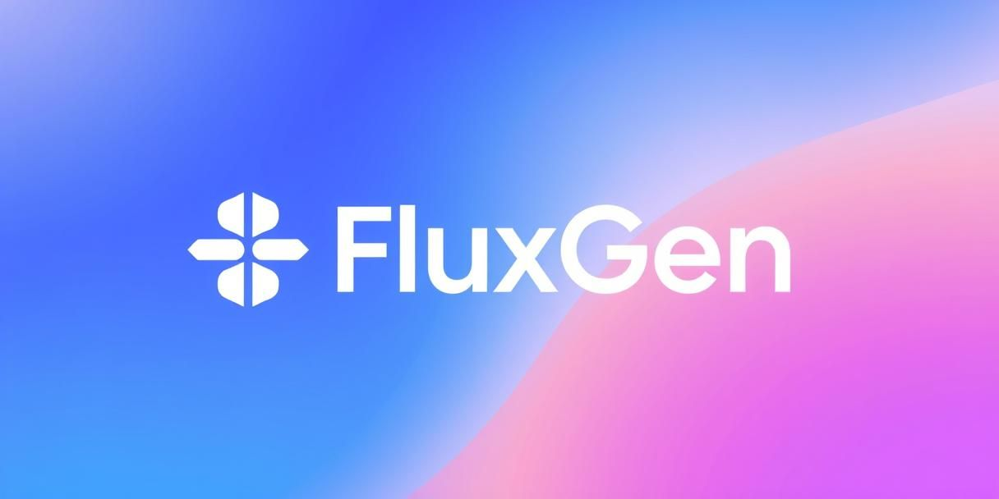

# FluxGen - AI Image Generator

A modern, feature-rich AI image generation application built with React, TypeScript, and powered by Together AI's FLUX.1 Schnell model. Create stunning images from text prompts with advanced customization options and real-time analytics.


<div align="center">
   <p><em>Transform your ideas into stunning visuals with AI-powered image generation</em></p>
</div>

## ✨ Features

### 🎨 **Advanced Image Generation**
- **Multiple Art Styles**: Choose from 8+ preset styles including Photorealistic, Artistic, Cinematic, Fantasy, Anime, and more
- **Custom Dimensions**: Support for various aspect ratios and custom dimensions up to 2048x2048
- **Quality Control**: Adjustable generation steps and enhancement options
- **Batch Generation**: Generate up to 4 images simultaneously
- **Seed Support**: Reproducible results with custom seed values

### 🛡️ **Enterprise-Grade Features**
- **Rate Limiting**: Multi-tier rate limiting (per minute/hour/day)
- **Content Filtering**: Advanced inappropriate content detection
- **Analytics Dashboard**: Comprehensive usage statistics and monitoring
- **Health Monitoring**: Real-time system status and service health checks
- **Error Handling**: Robust error handling with retry mechanisms

### 🎯 **User Experience**
- **Responsive Design**: Optimized for desktop, tablet, and mobile devices
- **Real-time Preview**: Instant image gallery with full-screen modal view
- **Download Support**: High-quality image downloads
- **Progressive Enhancement**: Smooth animations and micro-interactions
- **Accessibility**: WCAG compliant design with keyboard navigation

### 📊 **Admin Dashboard**
- **Usage Analytics**: Track requests, popular styles, and user patterns
- **System Monitoring**: Real-time health status and performance metrics
- **Client Management**: Monitor active users and rate limit status
- **Historical Data**: Detailed request history and parameter analysis

### 📚 **Comprehensive Documentation**
- **In-App Documentation**: Interactive documentation accessible via `/docs` route
- **API Reference**: Complete API documentation with examples
- **Deployment Guides**: Multiple deployment options and configurations
- **Contributing Guidelines**: Detailed contribution and development guides

## 🚀 Quick Start

### Prerequisites
- Node.js 18+ 
- npm or yarn
- Together AI API key

### Installation

1. **Clone the repository**
   ```bash
   git clone https://github.com/YatharthSanghavi/fluxgen.git
   cd fluxgen
   ```

2. **Install dependencies**
   ```bash
   npm install
   ```

3. **Set up environment variables**
   ```bash
   # Update the API_BASE_URL in src/hooks/useApi.ts
   # Point to your n8n webhook endpoint or API server
   ```

4. **Start the development server**
   ```bash
   npm run dev
   ```

5. **Open your browser**
   Navigate to `http://localhost:5173`

## 📖 Documentation

FluxGen includes comprehensive documentation accessible in multiple ways:

### In-App Documentation
Access the interactive documentation by clicking the **"Docs"** button in the navigation or visiting `/docs` in your browser. The documentation includes:

- **Overview** - Project introduction and key features
- **Getting Started** - Step-by-step installation guide
- **Features** - Detailed feature explanations with visual examples
- **API Reference** - Complete API documentation with code examples
- **Configuration** - Setup and customization guides
- **Deployment** - Multiple deployment options and guides

### Documentation Files
- **[API Documentation](docs/API.md)** - Detailed API reference
- **[Deployment Guide](docs/DEPLOYMENT.md)** - Comprehensive deployment instructions
- **[Contributing Guidelines](docs/CONTRIBUTING.md)** - How to contribute to the project

## 🏗️ Architecture

### Frontend Stack
- **React 18** - Modern React with hooks and concurrent features
- **TypeScript** - Type-safe development
- **Tailwind CSS** - Utility-first styling with custom design system
- **Vite** - Fast build tool and development server
- **React Router** - Client-side routing
- **Lucide React** - Beautiful, customizable icons

### Backend Integration
- **n8n Workflow** - Automated image generation pipeline
- **Together AI API** - FLUX.1 Schnell model integration
- **Rate Limiting** - Multi-tier request throttling
- **Analytics Engine** - Usage tracking and monitoring
- **Content Filtering** - Safety and compliance features

### Key Components
```
src/
├── components/
│   ├── admin/           # Admin dashboard components
│   ├── common/          # Reusable UI components
│   ├── docs/            # Documentation components
│   ├── forms/           # Form components
│   └── gallery/         # Image gallery components
├── hooks/               # Custom React hooks
├── types/               # TypeScript type definitions
├── constants/           # App constants and presets
└── App.tsx             # Main application component
```

## 🎨 Style Presets

FluxGen includes 8 carefully crafted style presets:

- **Default** - Standard generation without modifications
- **Photorealistic** - High-quality, realistic photography
- **Artistic** - Creative, expressive fine art style
- **Cinematic** - Dramatic lighting and film-like composition
- **Fantasy** - Magical, mystical, and enchanted themes
- **Anime** - Japanese animation and manga style
- **Vintage** - Retro, nostalgic, and classic aesthetic
- **Minimalist** - Clean, simple, and modern design

## 📱 Responsive Design

FluxGen is built with a mobile-first approach:

- **Mobile**: Collapsible form interface with touch-optimized controls
- **Tablet**: Adaptive grid layouts with optimized spacing
- **Desktop**: Full sidebar layout with advanced controls
- **Large Screens**: Multi-column gallery with enhanced previews

## 🔧 Configuration

### API Configuration
Update the API endpoint in `src/hooks/useApi.ts`:
```typescript
const API_BASE_URL = 'your-api-endpoint-here';
```

### Style Customization
Modify style presets in `src/constants/styles.ts`:
```typescript
export const STYLE_PRESETS = [
  {
    id: 'custom-style',
    name: 'Custom Style',
    description: 'Your custom style description',
    gradient: 'from-color-400 to-color-600'
  }
];
```

## 🛠️ Development

### Available Scripts
- `npm run dev` - Start development server
- `npm run build` - Build for production
- `npm run preview` - Preview production build
- `npm run lint` - Run ESLint

### Code Quality
- **ESLint** - Code linting with React and TypeScript rules
- **TypeScript** - Strict type checking
- **Prettier** - Code formatting (recommended)

## 📊 Analytics & Monitoring

The admin dashboard provides comprehensive insights:

- **Usage Statistics** - Total requests, unique clients, averages
- **Time Windows** - Activity over different time periods
- **Style Popularity** - Most used generation styles
- **System Health** - Service status and performance metrics
- **Client Activity** - Top users and request patterns

## 🔒 Security Features

- **Rate Limiting** - Prevents API abuse with configurable limits
- **Content Filtering** - Blocks inappropriate content generation
- **Input Validation** - Sanitizes and validates all user inputs
- **Error Handling** - Secure error messages without sensitive data exposure

## 🚀 Deployment

### Build for Production
```bash
npm run build
```

### Deploy to Netlify/Vercel
The built files in the `dist` folder can be deployed to any static hosting service.

### Docker Deployment
```bash
# Build the image
docker build -t fluxgen .

# Run the container
docker run -p 80:80 fluxgen
```

For detailed deployment instructions, see the [Deployment Guide](docs/DEPLOYMENT.md).

## 🤝 Contributing

We welcome contributions! Please see our [Contributing Guidelines](docs/CONTRIBUTING.md) for details.

1. Fork the repository
2. Create a feature branch (`git checkout -b feature/amazing-feature`)
3. Commit your changes (`git commit -m 'Add amazing feature'`)
4. Push to the branch (`git push origin feature/amazing-feature`)
5. Open a Pull Request

## 📄 License

This project is licensed under the MIT License - see the [LICENSE](LICENSE) file for details.

## 🙏 Acknowledgments

- [Together AI](https://together.ai) - For the powerful FLUX.1 Schnell model
- [n8n](https://n8n.io) - For the workflow automation platform
- [Tailwind CSS](https://tailwindcss.com) - For the utility-first CSS framework
- [Lucide](https://lucide.dev) - For the beautiful icon set

## 📞 Support

- 🐛 Issues: [GitHub Issues](https://github.com/YatharthSanghavi/fluxgen/issues)
- 💬 Discussions: [GitHub Discussions](https://github.com/YatharthSanghavi/fluxgen/discussions)
- 📖 Documentation: Access via `/docs` in the application

---

<div align="center">
  <p>Made with ❤️ by the FluxGen Team</p>
  <p>
    <a href="https://github.com/YatharthSanghavi/fluxgen/stargazers">⭐ Star us on GitHub</a> •
  </p>
</div>
